# 

1. Download Visual Studio
2. Open Visual Studio 
3. Click Create a new Project

    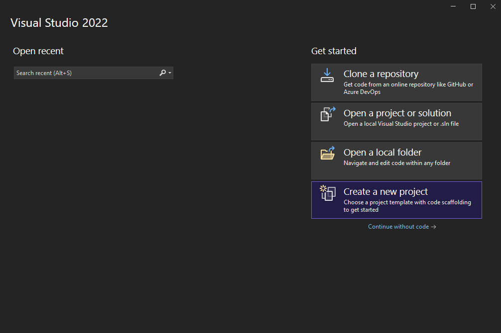

4. Select Dynamic-Link Library (DLL)

    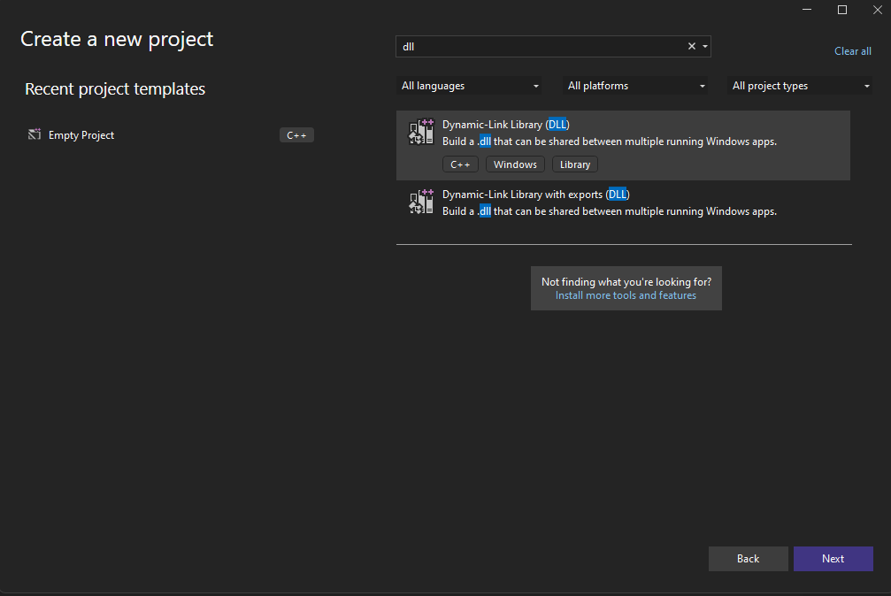

5. Select a location to store the project

    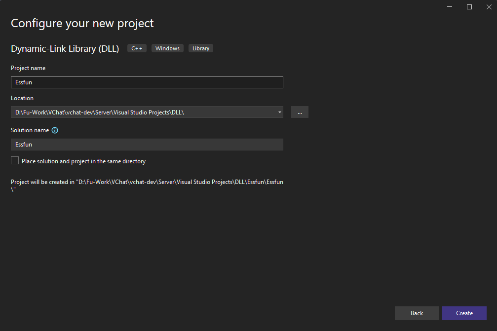

6. There may be a few pre-generated files as shown below, you can remove the `dllmain.cpp`, `pch.cpp`. and `pch.h`

    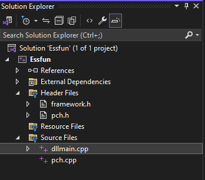

7. We can disable the use of precompiled headers in the following manner
   1. Open the Project Properties window: Project -> Properties

        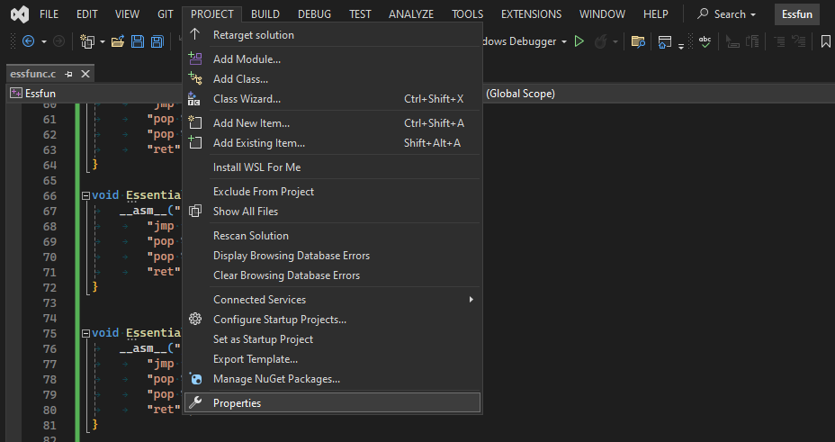

   2. Navigate to the Precompiled Headers options: C/C++ -> Precompiled Headers 

        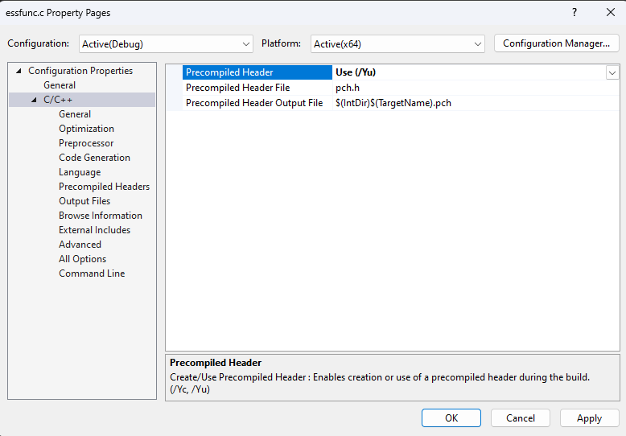

   3. Select "Not Using Precompiled Headers

        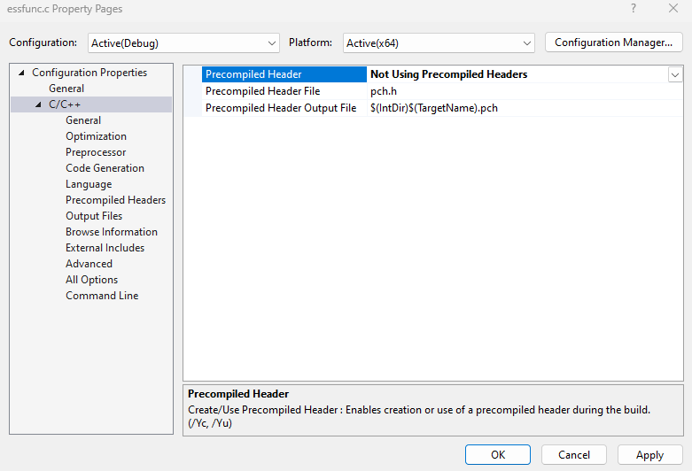

8. Now we should specify that this project will be compiled to x86, not x86-64 as may be the default
   1. Click on *Properties* in the Solution Explorer, or in the *Project* dropdown as shown previously

        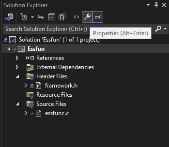

   2. Select *Platform* and *Win32*

        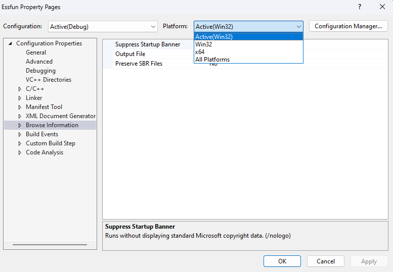

9. Now we can configure the *Linker*
   1.  Open the Linker *All Options* table as shown below

        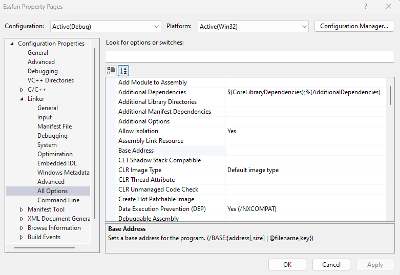

   2. Set the preferred base address

        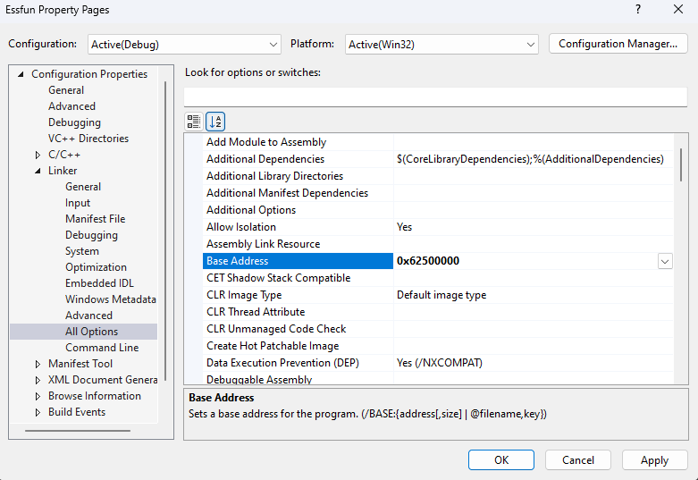

   3. Disable DEP

        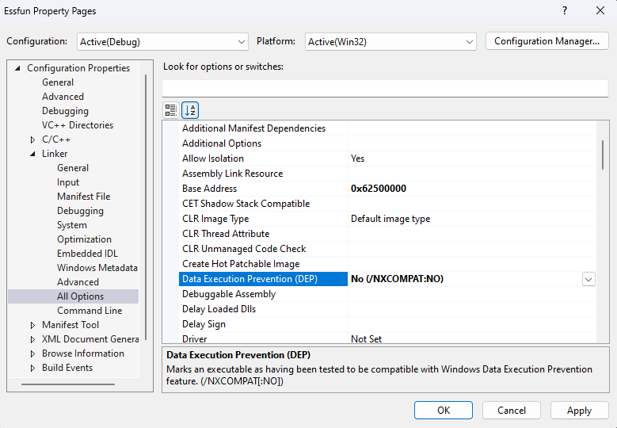

   4. Set Incremental Linking to NO - It does not appear we did this with the GCC version

        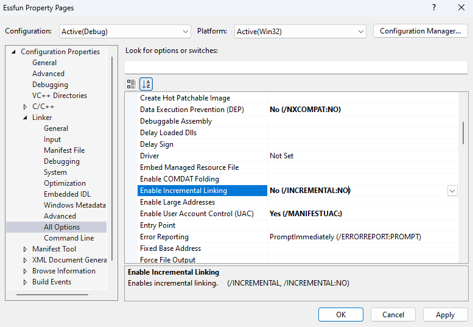

   5. Set SAFE-SEH to No

        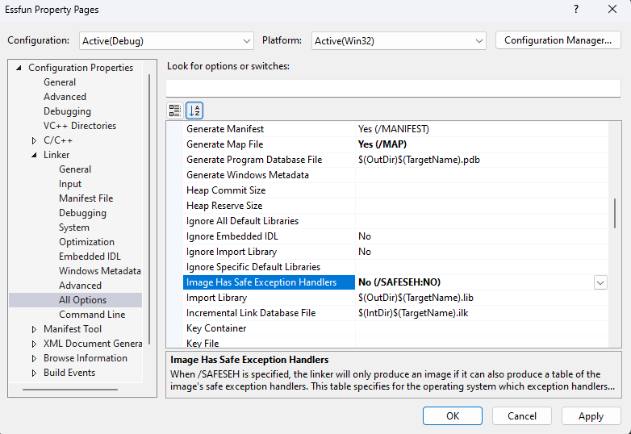

## Refs

https://learn.microsoft.com/en-us/cpp/build/creating-precompiled-header-files?view=msvc-170

https://learn.microsoft.com/en-us/cpp/assembler/inline/inline-assembler?view=msvc-170

https://edgesupport.diasemi.com/hc/en-us/articles/205663464-How-to-set-up-your-Visual-Studio-project-to-build-for-x86-Hardware-platform-KB1025#:~:text=Click%20BUILD%20%3E%20CONFIGURATION%20MANAGER%20select%20the%20platform,create%20x86%20as%20a%20platform%20option%20to%20choose.